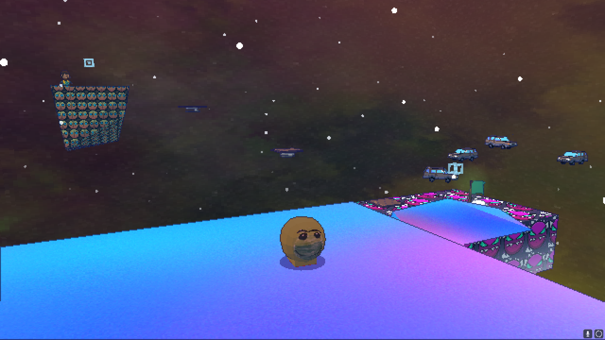

# Fire In The Hole 64 | Mod for Celeste 64
Welcome to the official page for the "Fire In The Hole 64" mod! This mod brings the vibrant world of Geometry Dash into Celeste 64, featuring custom Geometry Dash faces on textures, Lobotomy Dash-inspired models, new dialogue, and an exclusive level named "Slopenheimer" with 6 hidden strawberries.

Get the game this mod is for here; https://maddymakesgamesinc.itch.io/celeste64
ModDB Page; https://www.moddb.com/mods/fire-in-the-hole-64

<p float="left">
  
  
  
</p>

## Features
- Geometry Dash-inspired textures and custom models
- New dialogue for a fresh experience
- A custom level "Slopenheimer" with 6 strawberries to collect
- Unique "Fire in the hole!" theme

## Installation Guide
__Step 1__: Download the Content.zip file from the releases section.

__Step 2__: Extract the Content.zip file. You will find a Content folder inside.

__Step 3__: Locate your Celeste 64 installation directory (where Celeste64.exe is located). Drop the extracted Content folder into this location, replacing all files when prompted.

__Step 4__: Modify the levels.json File:

- In the Content folder inside the Celeste 64 directory, find and open the levels.json file with Notepad or another text editor.
- Add the following JSON object to the array and dont forget the comma to seperate the elements:
```json
  {
    "ID": "1_GEOMETERY_DASH",
    "Name": "Slopenheimer",
    "Label": "Fire in the hole!",
    "Strawberries": 7,
    "Preview": "Postcards/goggydash",
    "Map": "Geometery Dash/test"
  }
```

## Setup Complete

You're all set! Launch Celeste 64, and you'll find the "Slopenheimer" level available to play (if not check you have done step 4 properly), complete with all the new mod features. Enjoy the fusion of Celeste and Geometry Dash, and thanks for playing "Fire In The Hole 64"!

<p float="left">
  
</p>
